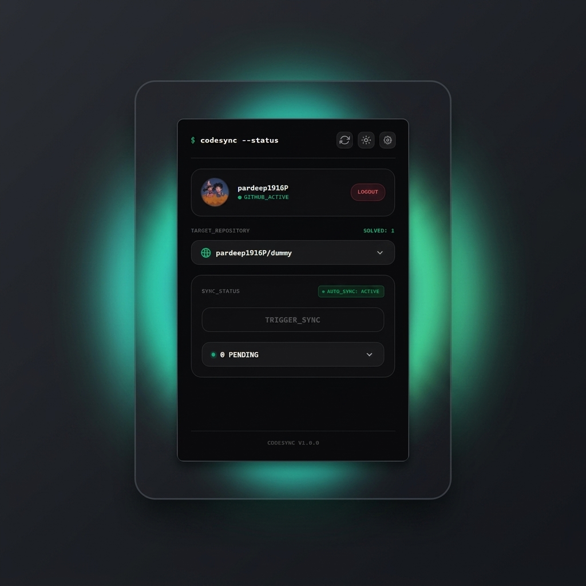

# CodeSync

<p align="center">
  
</p>

CodeSync is a lightweight and beautiful browser extension that automatically saves your accepted LeetCode submissions and pushes them directly to your personal GitHub repository. Built with a sleek terminal-inspired design, it gives you a centralized dashboard to track your solved problems, manage pending commits, and customize themes to match your coding setup.

---

## ✨ Key Features

* **⚡ Instant Auto-Sync**: Pushes your accepted LeetCode solutions to GitHub the moment you solve them.
* **📥 Pending Commit Queue**: Keep Auto-Sync off to hold your solutions in a local queue, allowing you to review, delete, or sync them manually whenever you want.
* **🔄 Smart Deduplication**: If you submit the same problem multiple times, CodeSync automatically updates the queue with your latest solution so you never push duplicate commits.
* **🎨 15+ Curated Themes**: Choose from vibrant layouts (AMOLED, Dracula, Tokyo Night, Cyberpunk, Matrix, Nord, and more) to fit your dark mode aesthetic.
* **🔒 Private & Secure**: Authenticate securely using GitHub OAuth or your own Personal Access Token (PAT). Your credentials are saved locally in your browser storage.
* **🚀 Lightweight & Silent**: Zero background battery drain and 100% silent runtime with no console log noise.

---

## 🚀 Easy Setup Guide

### Step 1: Install the Extension
1. Clone the repository and build the project:
   ```bash
   git clone https://github.com/pardeep1916P/codeSync.git
   cd codeSync
   npm install
   npm run build
   ```
2. Open Google Chrome and go to `chrome://extensions/`.
3. Turn on **Developer mode** (toggle in the top-right corner).
4. Click **Load unpacked** (button in the top-left corner) and select the `dist` folder created in your project directory.

### Step 2: Connect your GitHub Account
1. Click the **CodeSync** icon in your browser extension toolbar.
2. Click **Authenticate with OAuth** to log in instantly, or enter a **GitHub Personal Access Token (PAT)** with `repo` permissions.
3. Select your target repository from the dropdown.
4. Toggle **Auto-Sync** to active, and start solving problems on LeetCode!

---

## 🛠️ Developer Documentation

Are you looking to modify the extension, run local tests, or configure CI/CD release pipelines? Check out our [Developer Guide](document.md).

---

## 📄 License

Licensed under the [Apache License, Version 2.0](LICENSE).
