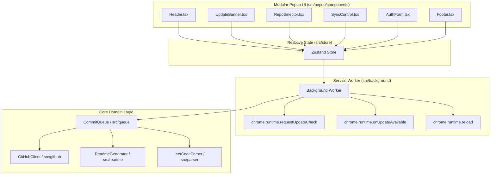

# System Architecture
 
CodeSync is organized into decoupled domain layers with a modular UI architecture:

### Module Responsibilities:
- **`src/content/`**: Intercepts LeetCode network submissions and bridges payload data to background worker.
- **`src/parser/`**: Pure functions for extracting and normalizing problem descriptions and metadata.
- **`src/queue/`**: Deduplication state machine for FIFO queue persistence and bulk atomic Git Tree commit batching.
- **`src/github/`**: Batched GraphQL & Git Trees client for ultra-fast, sub-second atomic multi-file commits.
- **`src/readme/`**: Decoupled Markdown and HTML table generator for solutions and README indexes.
- **`src/storage/`**: Typed wrapper over `chrome.storage.local`.
- **`src/store/`**: Reactive Zustand state caching.
- **`src/popup/components/`**: Modular, single-responsibility UI blocks.

