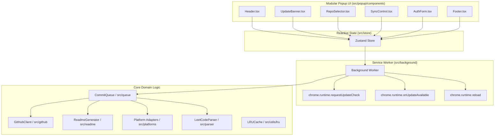

# System Architecture
 
CodeSync is organized into decoupled domain layers with a modular UI architecture:

### Module Responsibilities:
- **`src/content/interceptor.ts`**: Native Manifest V3 MAIN-world interceptor for monkey-patching `window.fetch`/`XMLHttpRequest` at `document_start`.
- **`src/content/index.ts`**: ISOLATED-world content script bridging intercepted data to service worker, with in-memory LRU question metadata caching.
- **`src/platforms/`**: Extensible multi-platform adapter registry supporting LeetCode, Codeforces, HackerRank, and GeeksforGeeks.
- **`src/parser/`**: Pure functions for extracting and normalizing problem descriptions and metadata.
- **`src/queue/`**: Deduplication state machine for FIFO queue persistence, directory template resolution, and bulk atomic Git Tree commit batching.
- **`src/github/`**: Batched GraphQL & Git Trees client with explicit `author.date` and `committer.date` timestamp preservation.
- **`src/readme/`**: Decoupled Markdown and HTML table generator for solutions and README indexes.
- **`src/utils/lru.ts`**: High-performance bounded O(1) LRU cache to eliminate memory leaks and garbage collection churn.
- **`src/storage/`**: Typed wrapper over `chrome.storage.local` with AES-GCM token encryption.
- **`src/store/`**: Reactive Zustand state caching.
- **`src/popup/components/`**: Modular, single-responsibility UI blocks.

