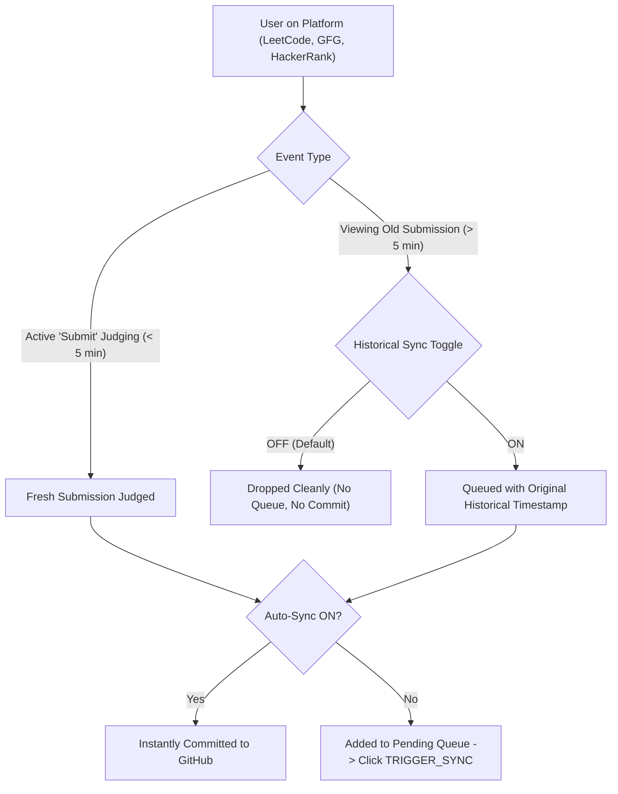

# Architecture & Implementation: Historical Submissions Sync & Multi-Platform Guarding

## 1. Overview & Problem Solved
When a user navigates to the **"Submissions"** tab on LeetCode (or future platforms) and inspects an older accepted solution, the platform queries its API for the submission details.

Previously, inspecting an old submission triggered an automatic commit. CodeSync now isolates **Active Judging** from **Historical Submission Browsing** via a configurable toggle and timestamp freshness guard.

---

## 2. Universal Flow Architecture

---

## 3. Implemented Components

### A. Settings Toggles (`src/options/Options.tsx`)
Built with accessible **Radix UI & shadcn/ui** components (`Switch` and `Label`):
- **Instant Sync on Accept** (`syncOnAccept`): Real-time sync for active problem solves.
- **Historical Submissions Sync** (`syncHistoricalOnView`, **OFF by default**): Controlled syncing for past submissions.

### B. Popup Badge Behavior (`src/popup/components/SyncControl.tsx`)
- **When OFF (Default)**: Popup UI remains completely untouched with zero extra badges.
- **When ON**: `[HIST_SYNC: ACTIVE]` badge renders to the **left** of `AUTO_SYNC` with zero layout displacement.

### C. Multi-Platform Timestamp Freshness Guard (`src/content/index.ts`)
- Submissions solved $> 300\text{s}$ ago (5 minutes) or flagged as historical are checked against `syncHistoricalOnView`.
- If `false`, the event is immediately discarded without touching the pending queue or GitHub API.

---

## 4. Multi-Platform Extension Readiness

| Platform | Past Submissions Trigger | Historical Handling |
| :--- | :--- | :--- |
| **LeetCode** | `submissionDetails` GraphQL / Submissions Tab | Active judge ID tracking + 5-minute timestamp freshness guard |
| **GeeksforGeeks** (Phase 5) | GFG Submissions Tab (`/api/problems/...`) | Extracts past submission date and passes through `syncHistoricalOnView` |
| **HackerRank** (Phase 5) | Leaderboard / History REST API | Normalizes payload with original timestamp |
| **Codeforces** (Phase 6) | `user.status` Public API | Supports single-view sync and 1-click all-time sync |
| **CodeChef** (Phase 6) | `/viewsolution/<id>` Modal | Extracts historical date and language code |

