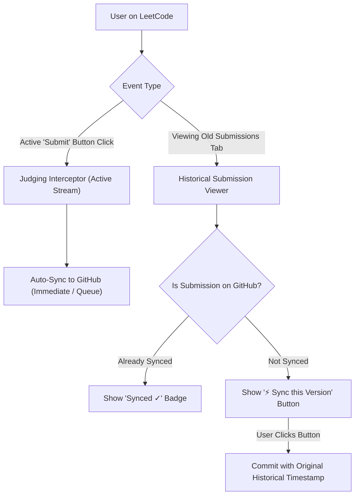

# Feature Plan: Historical Submissions Sync & Viewing Controls (Next Version)

## 1. Problem Statement & User Experience Challenge
Currently, when a user navigates to the **"Submissions"** tab on LeetCode and clicks on a past accepted submission (e.g. from July or August 2026), LeetCode issues a `submissionDetails` GraphQL query to fetch the code.

The current network interceptor captures every `submissionDetails` with `statusCode: 10` (Accepted). As a result, simply *inspecting* an old submission triggers an automatic sync commit to GitHub.

---

## 2. Target Vision: Converting This Behavior into a Robust Feature

Instead of accidental syncing on view, we will separate **Active Judging** from **Historical Submission Management** and provide user-controlled syncing.

---

## 3. Proposed Feature Specifications

### A. Separation of Active Submissions vs. Browsing
1. **Active Judging Detection**:
   - Only trigger automatic sync when a fresh submission is actively judged:
     - LeetCode `/check/` polling endpoint.
     - `submissionProgress` GraphQL response with `state: "SUCCESS"`.
     - Correlation with user clicking the LeetCode **"Submit"** button.
2. **Browsing Filter**:
   - `submissionDetails` queries triggered purely by clicking rows in the Submissions history list will **NOT** trigger automatic background sync by default.

---

### B. In-Page "Sync this Submission" Button (LeetCode Submissions Tab)
When a user opens any historical submission modal/view on LeetCode:
- CodeSync injects a sleek terminal-themed button:
  - If already on GitHub: Shows a discreet **`[Synced to GitHub ✓]`** badge.
  - If not on GitHub: Shows an interactive **`[⚡ Sync to GitHub]`** button.
- When clicked, CodeSync syncs that specific solution to GitHub preserving its **original historical timestamp** (e.g. `Jul 10, 2026`).

---

### C. Settings Configuration: Historical Submissions Mode
In the CodeSync Options / Settings page, add a new setting:
- **`Sync Mode for Viewed Submissions`**:
  - `Manual (Recommended)`: Only active submissions auto-sync; past submissions show the manual "Sync to GitHub" button.
  - `Automatic`: Any past submission opened in the Submissions tab is automatically queued and synced.
  - `Disabled`: Never sync from the Submissions tab.

---

### D. Bulk Historical Sync Tool (Options Page)
In the Options page, add a **"Sync Problem History"** utility:
- Fetches all historical accepted submissions for a given problem or recent problem list.
- Automatically selects the fastest / most recent solution for each language (C++, Java, Python, etc.) and performs a single bulk atomic commit.

---

## 4. Implementation Phasing

1. **Phase 1 (Interceptor Guarding)**:
   - Filter `interceptor.ts` so `CODESYNC_SUBMISSION_ACCEPTED` only fires for active submissions.
2. **Phase 2 (In-Page UI Integration)**:
   - Inject the `Sync to GitHub` button and status badge into LeetCode's submission detail modal.
3. **Phase 3 (Settings & Bulk Sync)**:
   - Add historical sync toggle in `Options.tsx` and bulk history sync tool.
