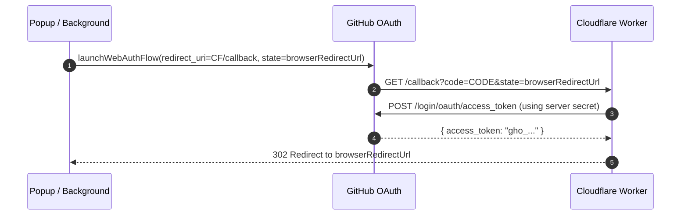

# Compound Learning: Universal Zero-Secret Multi-Browser OAuth

## Context & Problem
When deploying browser extensions across multiple Chromium stores (Chrome Web Store, Microsoft Edge Add-ons, Firefox AMO, Opera, Brave, Arc, etc.), each browser assigns a different extension ID or redirect URL scheme:
- Chrome: `https://<chrome_id>.chromiumapp.org/`
- Edge: `https://<edge_id>.chromiumapp.org/` or `https://edge.microsoft.com/`
- Local Development: Temporary randomized extension ID during unpacked loads.

GitHub OAuth requires a pre-registered, static **Authorization Callback URL**. Registering separate GitHub Apps for every browser distribution and bundling GitHub Client Secrets in client-side code creates a severe security flaw.

## Solution Architecture
We implemented a serverless proxy on Cloudflare Workers (`https://codesync-oauth.chaitanyacharan07.workers.dev`) using dynamic state redirection:

### Key Implementation Principles:
1. **Zero Client Secrets**: `GITHUB_CLIENT_SECRET` exists strictly within Cloudflare Worker environment variables. Extension builds contain 0 secrets.
2. **Dynamic State Routing**: The browser extension encodes its local `chrome.identity.getRedirectURL()` into the OAuth `state` parameter. The Cloudflare Worker exchanges the code server-side and 302 redirects directly to that specific browser's extension URI.
3. **Background Worker Execution**: The OAuth flow is triggered via `chrome.runtime.sendMessage({ action: 'START_OAUTH_FLOW' })` inside the background service worker so that user clicks or popup closures never interrupt the authentication handshake.
