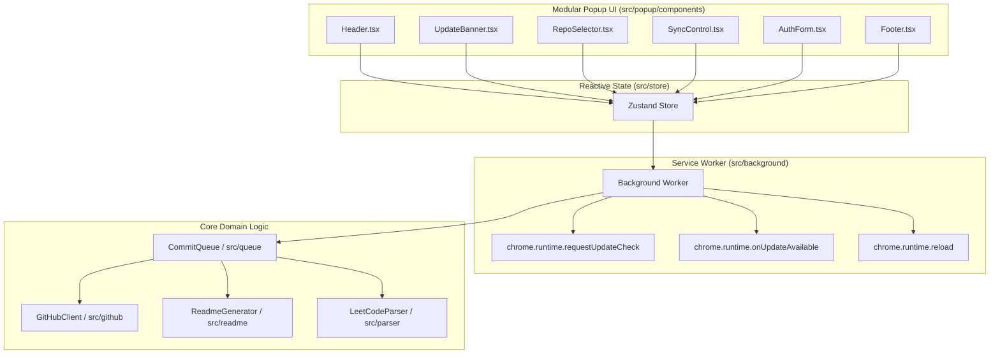

# CodeSync Developer Documentation

This document contains technical information regarding the architecture, development commands, and CI/CD pipelines of CodeSync.

---

## 🛠️ Local Installation & Development Setup

If you want to run or test the extension locally, follow these steps:

1. **Clone the Repository**:
   ```bash
   git clone https://github.com/pardeep1916P/codeSync.git
   cd codeSync
   ```
2. **Install Dependencies & Build**:
   ```bash
   npm install --legacy-peer-deps
   npm run build
   ```
3. **Load the Extension into Chrome**:
   - Open Google Chrome and navigate to `chrome://extensions/`.
   - Enable **Developer mode** in the top-right corner.
   - Click **Load unpacked** in the top-left corner.
   - Select the `dist/` directory generated in the project root folder.

---

## 💻 Development Commands

* **`npm run dev`** — Launch Vite development build with live watch mode (full debug logging enabled in Chrome).
* **`npm run build:dev`** — Build extension package for local development with full diagnostic logs enabled.
* **`npm run build`** — Compile TypeScript and generate clean, minified production build with all console logging automatically stripped for store deployment.
* **`npm run lint`** — Run ESLint checks across source tree.
* **`npm run test`** — Execute unit tests using Vitest.

> [!TIP]
> **Debugging Production Builds**: If you need to debug a minified production build, run:
> ```bash
> VITE_ENABLE_LOGS=true npm run build
> ```

---

## 🤖 CI/CD Release Pipeline

We use **GitHub Actions** (`.github/workflows/release.yml`) to automate code verification, release packaging, and cross-browser distribution:
- **Build and Test Validation**: Every push with source changes triggers a workflow that installs dependencies, runs ESLint, executes Vitest unit tests, and verifies that the production bundle compiles cleanly.
- **Smart Whitelist Path Filtering**: The workflow uses explicit `paths:` triggers (`src/**`, `public/**`, `package.json`, build configs) so commits touching only documentation, OpenSpec specifications, or context logs never trigger redundant CI runners.
- **Automated Multi-Browser Store Deployment**:
  - **Chrome Web Store**: Published automatically via `chrome-webstore-upload-cli` (covers **Google Chrome**, **Brave**, **Arc**, and **Vivaldi**).
  - **Microsoft Edge Add-ons Store**: Published automatically via `wdzeng/edge-addon@v2`.
  - **GitHub Releases**: Generates a tagged release (`v<version>`) attaching both `codesync-extension.zip` and `dist.zip` with automated release notes.
- **Repository Secrets & Variables**: Configure the following in your GitHub repository (**Settings** $\rightarrow$ **Secrets and variables** $\rightarrow$ **Actions**):
  - `VITE_GITHUB_CLIENT_ID` *(Secret / Variable)*: GitHub OAuth App Client ID.
  - `VITE_OAUTH_PROXY_URL` *(Variable)*: Secure OAuth Proxy URL (e.g. `https://<your-worker-name>.<your-subdomain>.workers.dev`).
  - `CHROME_EXTENSION_ID` *(Secret)*: Chrome Web Store Extension ID.
  - `CHROME_CLIENT_ID` *(Secret)*: Google Cloud OAuth Client ID for Chrome Web Store API.
  - `CHROME_CLIENT_SECRET` *(Secret)*: Google Cloud OAuth Client Secret for Chrome Web Store API.
  - `CHROME_REFRESH_TOKEN` *(Secret)*: Google Cloud OAuth Refresh Token for Chrome Web Store API.
  - `EDGE_PRODUCT_ID` *(Secret)*: Microsoft Edge Extension Product ID.
  - `EDGE_CLIENT_ID` *(Secret)*: Microsoft Edge Add-ons API Client ID.
  - `EDGE_API_KEY` *(Secret)*: Microsoft Edge Add-ons API Key.
- **Local Development Environment**: For local testing, copy `.env.example` to `.env` and configure your credentials. The `.env` file is excluded from Git tracking in `.gitignore`.

---

## 🔒 Security Architecture

### Zero-Client-Secret Universal OAuth Architecture
CodeSync implements a zero-client-secret pattern combined with a universal multi-browser callback hub:
- **No Client Secrets in Extension**: The GitHub OAuth App Client Secret is NEVER bundled in frontend client builds.
- **Universal Multi-Browser OAuth Proxy**: A dedicated serverless worker (`codesync-oauth`) deployed on Cloudflare's global edge network safely handles OAuth callbacks (`/callback`). It acts as a static bridge between GitHub OAuth and dynamic browser extension IDs (Google Chrome, Microsoft Edge, Brave, Arc, Vivaldi, and local development builds) by forwarding tokens back to the originating browser context via state parameters.

### At-Rest Credential Encryption
- All Personal Access Tokens and OAuth access tokens stored in `chrome.storage.local` are encrypted at rest using **AES-GCM (256-bit)** with key derivation via the **Web Crypto API (`crypto.subtle`)** in [`src/utils/crypto.ts`](file:///c:/Users/CharanChaitanyaDevan/Downloads/temp/codeSync/src/utils/crypto.ts).

---

## 📋 OpenSpec Spec-Driven Development Framework

CodeSync uses [OpenSpec](https://github.com/Fission-AI/OpenSpec) (`@fission-ai/openspec`) for Spec-Driven Development (SDD).

* **Specification Folder**: `openspec/`
* **Configuration**: `openspec/config.yaml`
* **Slash Commands**:
  - `/opsx-propose "feature idea"` — Propose a new spec-driven change.
  - `/openspec-apply` — Execute tasks according to an approved spec proposal.
  - `/openspec-archive` — Archive completed changes into main specifications.

---

## 🏗️ Architecture & Component Hierarchy

CodeSync is organized into decoupled domain layers with a modular UI architecture:



---

## 📂 Project Structure

```
├── .github/
│   └── workflows/          # GitHub Actions CI/CD workflows (Build, Test, Deploy)
├── docs/                   # Project documentation & promotional media assets
├── public/                 # Manifest configuration and production icons
├── src/
│   ├── background/         # Service worker managing update alarms, queues, and messaging
│   ├── components/         # Common reusable UI components (Button, etc.)
│   ├── content/            # LeetCode DOM bridge and network interceptor
│   ├── github/             # Git Trees API client and OAuth integrations
│   ├── parser/             # Submission parsers (pure functions with unit tests)
│   ├── popup/              # Main Dashboard React user interface
│   │   └── components/     # Modular UI blocks (Header, UpdateBanner, SyncControl, etc.)
│   ├── queue/              # Submission commit queue logic and deduplication
│   ├── readme/             # README table and markdown index generators
│   ├── storage/            # Typed abstractions over chrome.storage.local
│   ├── store/              # Global state managed via Zustand
│   ├── styles/             # Curated themes and Tailwind styles
│   └── utils/              # Helper utilities (dynamic versioning, etc.)
├── README.md               # Repository overview and guide
└── vite.config.ts          # Vite build configuration
```
